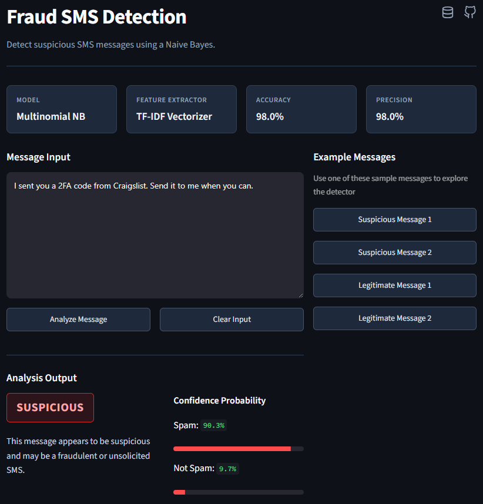

# [Fraud SMS Detection](https://fraud-sms-detection.streamlit.app/)

A machine learning project that detects fraudulent SMS messages using **Naive Bayes**.

## How I Built this Project

### Data Cleaning 

- Loaded the SMS dataset (**~5,572** raw messages) and performed initial inspection to understand its structure, check for missing values, and remove unnecessary columns.
- Encoded the target labels `0` for ham/legitimate, `1` for spam/suspicious.

### Exploratory Data Analysis

- **Class Distribution**
    The dataset contained **4,516** legitimate messages and **653** suspicious messages. This class imbalance indicated that the model could naturally favor predicting the majority class more frequently. To address this issue, **SMOTE** (Synthetic Minority Over-sampling Technique) was applied to balance the dataset, enabling the model to better learn and accurately identify suspicious messages.

- **Feature Engineering**: 
    Additional features were derived such as **num_characters**, **num_words**, and **num_sentences** to analyze the characteristics of legitimate and suspicious SMS. Class-wise descriptive statistics revealed clear differences between legitimate and suspicious messages.Suspicious messages were considerably longer, with an average of **137** characters, **27** words, and **3** sentences, compared to legitimate messages, which averaged **70** characters, **17** words, and **2** sentences. Also an **outliers** reaching up to **910** characters present in the dataset.

### Text Preprocessing 

To reduce noise and standardize input text before vectorization, I implemented a reusable `transform_text` function:

- **Lowercasing**: Standardized all text to lowercase.
- **Tokenization**: Segmented text into individual tokens (words) using NLTK's `word_tokenize`.
- **Punctuation and Special Character Removal**: Kept only alphanumeric tokens.
- **Stopword Filtering**: Removed common English stopwords (`nltk.corpus.stopwords`).
- **Stemming**: Reduced words to their root forms using Porter Stemmer (`PorterStemmer`).

### Model Experimentation

I evaluated multiple vectorization and balancing approaches to maximize precision and recall for suspicious messages:

| Experiment | Text Representation | Class Balancing | Accuracy | Precision | Recall | F1-Score |
| :--- | :--- | :--- | :---: | :---: | :---: | :---: |
| **1** | Bag of Words | None | 97.0% | 0.84 | 0.91 | 0.88 |
| **2** | TF-IDF | None | 97.0% | **1.00** | 0.79 | 0.88 |
| **3** | **TF-IDF** | **SMOTE** | **98.0%** | **0.98** | **0.98** | **0.98** |

#### Summary

- **Bag of Words model**: High accuracy but produced more false positives for spam.
- **TF-IDF**: Improved spam precision to 100%, but spam recall decreased, resulting in missed spam messages.
- **TF-IDF with SMOTE**: Significantly improved the classifier, achieving **98%** accuracy with balanced precision, recall, and F1-score across both classes.

## Preview

